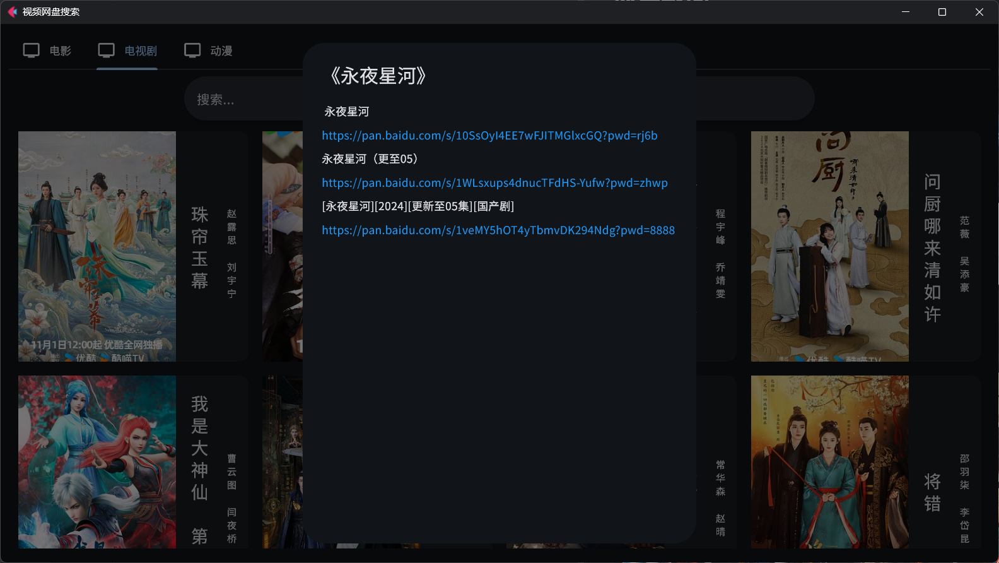

# 视频网盘搜索app

运行app

```
flet run main.py
```

打包app 

```
flet pack main.py --add-data "assets;assets"
```

参考 [Publishing Flet app to multiple platforms](https://flet.dev/docs/publish)


## 应用功能

鼠标停留显示视频简介

左键点击显示百度网盘链接

右键点击跳转到对应豆瓣页面

视频搜索功能


## 应用截图


